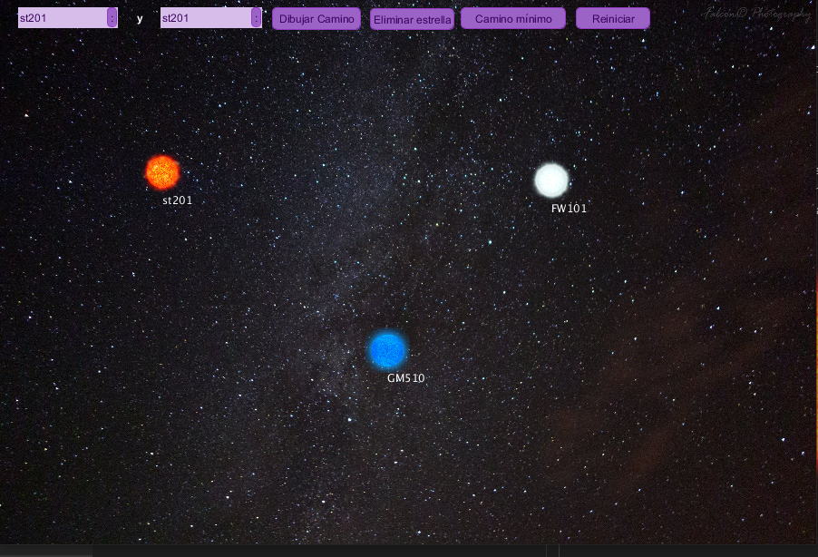
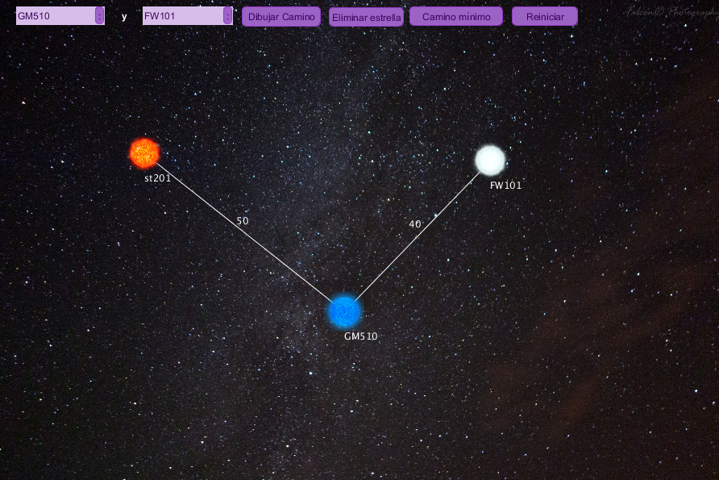
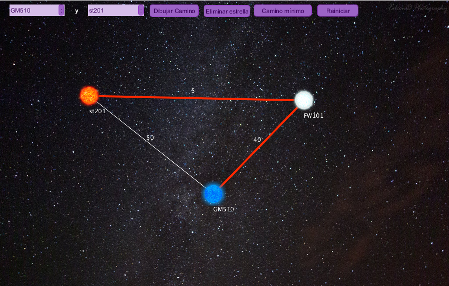

# Star Map
This project was made for implementing floyd-Warshall's algorithm.
## Use
* Clone the project or download the zip of repository.
* Install the library "G4P" in Processing. You can search it in Sketch>Import library>add library.
* Run
* Use right click to add stars and the upper controls to draw and delete the routes and also calculates the shortest path.
## 
## 
## 
    